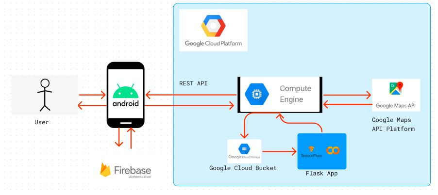

# Cloud Computing
Cloud Computing team's responsibilities includes designing the application architecture, determining how the Android app interacts with the machine learning models and how cloud services handle data storage, processing, and retrieval. Users' uploaded images are securely stored in our project's bucket on the Google Cloud Platform. For the authentication process, we connected our Google Cloud Platform project to the Firebase Authentication service, ensuring secure storage of user data in the Firestore database. To enable the detection process within the Android application, we provided the API endpoint of our Flask App, allowing access to the machine learning model processing. This model was deployed on our Virtual Machine Instance using the Compute Engine service from Google Cloud.
 

 **Application Architecture**:

  

**Authentication**:

