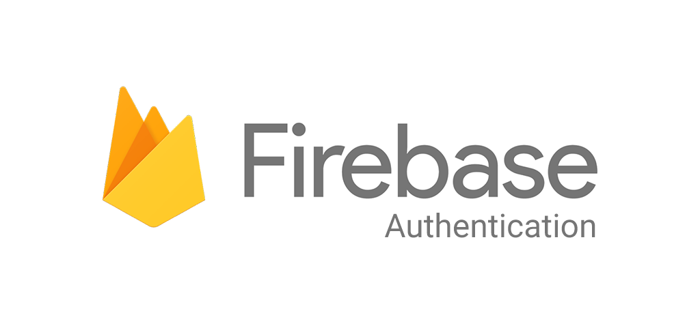

# Cloud Computing
Cloud Computing team's responsibilities includes designing the application architecture, determining how the Android app interacts with the machine learning models and how cloud services handle data storage, processing, and retrieval. Users' uploaded images are securely stored in our project's bucket on the Google Cloud Platform. For the authentication process, we connected our Google Cloud Platform project to the Firebase Authentication service, ensuring secure storage of user data in the Firestore database. To enable the detection process within the Android application, we provided the API endpoint of our Flask App, allowing access to the machine learning model processing. This model was deployed on our Virtual Machine Instance using the Compute Engine service from Google Cloud.
<br>

<br>**Application Architecture**:

<p align="center">
  
</p>

**Authentication**:

<p align="center">
  
</p>

We use the Firebase Authentication service provided by Google Firebase that allows us to easily add user authentication and identity management to our applications. It provides a secure and reliable way to handle user sign-up, sign-in, and other authentication-related features. When a user signs up or logs into an application using Firebase Authentication, the service performs the necessary authentication checks, such as verifying the user's email and password credentials or validating their identity through a third-party provider like Google or Facebook.

## Service
To enable the detection process within the Android application, we provided the API endpoint of our Flask App, allowing access to the machine learning model processing. This model was deployed on our Virtual Machine Instance using the Compute Engine service from Google Cloud.

Endpoint API POST: 35.224.238.145/upload

**Postman Documentation**
<p align="center">
  
</p>


## How to Run the Code

Follow the steps below to run the code on your local machine.

### Prerequisites
- Virtual Machines
- SSH access to the VM
- Machine Learning Model
- Service Account Key

### Virtual machines

1. Create a virtual machine (VM) in the us-central1 region, using the n1-standard1 machine type, allowing HTTP and HTTPS traffic, reserving a static external IP, and create it.

2. Once it's finished, run SSH.

3. Update the package list on the VM:
```shell
sudo apt update
sudo apt upgrade
```

4. Install Git on the VM:
```shell
sudo apt install git
```

### Clone the Repository
1. Clone the code from GitHub:
```shell
git clone -b cloud_computing https://github.com/mfhutabarat/C23-PC609.git
```
2. Change to the C23-PC609 directory:
```
cd C23-PC609
```

### Setup Python Environment
1. Install Python by running the following command:
```shell
sudo apt install python3-pip
```
2. Create a virtual environment for your Flask project by executing the following command:
```shell
sudo apt install python3.8-venv
python3 -m venv myenv
```
3. Activate the virtual environment by running the following command:
```shell
source myenv/bin/activate
```
### Configure Nginx
1. Install Nginx on your VM:
```shell
sudo apt-get install -y nginx
```
2. Open the Nginx configuration file for editing:
```shell
sudo nano /etc/nginx/sites-available/default
```
3. Replace the server settings with the following configuration:
```perl
server {
  listen 80;
  server_name YOUR_SERVERS_IP_ADDRESS;

  location / {
    proxy_pass "http://127.0.0.1:8080";
    proxy_http_version 1.1;
    proxy_set_header Upgrade $http_upgrade;
    proxy_set_header Connection 'upgrade';
    proxy_cache_bypass $http_upgrade;
  }
}
```
change the server_name YOUR_SERVERS_IP_ADDRESS with your external IP from intances

4. Save the file and exit the editor.

### Restart Nginx
To apply the changes, restart the Nginx service:
```shell
sudo service nginx restart
```

### Configure Flask
1. Install the required dependencies:
```shell
pip install -r requirements.txt
```
2. Create a service account to obtain the key.json file.
3. Upload the key.json file via SSH.
4. Move the key.json file to the Flask directory.

5. Download the machine learning model from Google Drive:
```shell
wget --load-cookies /tmp/cookies.txt "https://docs.google.com/uc?export=download&confirm=$(wget --quiet --save-cookies /tmp/cookies.txt --keep-session-cookies --no-check-certificate 'https://docs.google.com/uc?export=download&id=FILEID' -O- | sed -rn 's/.*confirm=([0-9A-Za-z_]+).*/\1\n/p')&id=1zEwP6uu5wUaMbmvO5xri4Oy15AoGacnE" -O model3_binary_categorical.h5 && rm -rf /tmp/cookies.txt
```

6. Run the Flask app using the following command:
```shell
python3 main.py
```

### Accessing the API
The API is now ready to use. You can access it by making requests to your server's IP address on port 8080.

Remember to replace "YOUR_SERVERS_IP_ADDRESS" with the actual IP address of your server.

For the endpoint:
- POST: your_ip/upload
- POST: your_ip/save
- PUT : your_ip/pet/edit?id={id}&name={name}
- GET : your_api/pet/edit?id={id}&name={name}
- GET : your_api/pet/{email}
- GET : your_api/pet/{email}/{id}

### Contributing
Contributions are welcome! If you find any issues or have suggestions for improvements, feel free to open an issue or create a pull request.
